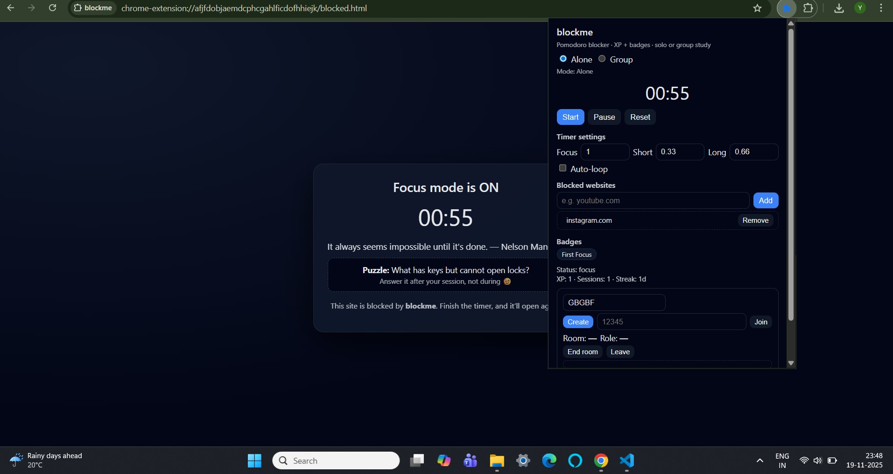

# blockme — Productivity + Group Study Chrome Extension

**blockme** is a lightweight productivity Chrome extension that combines:

- Website blocking  
- Pomodoro-style focus sessions  
- XP, streaks & badges  
- Real-time **group study mode** with chat  
- Firebase-based room system  
- Motivational quotes + puzzles  
- Clean and simple UI  

Perfect for both **solo study** and **group study sessions**.

---

## ⭐ Features

### 🔒 Smart Website Blocking
- Add/remove any distracting website (youtube.com, instagram.com, etc.)
- Websites are blocked **only during focus mode**
- Users trying to visit a blocked site are redirected to a custom **blocked page** containing:
  - A **real-time countdown**
  - A random **motivational quote**
  - A **puzzle/riddle** to solve

---

### ⏳ Pomodoro Focus Timer
- Fully configurable:
  - **Focus duration**
  - **Short break**
  - **Long break**
- Supports **manual typing** (1 to 180 minutes)
- Auto-loop mode for continuous focus cycles
- Real-time countdown displayed in popup AND blocked page

---

### 🏆 Gamification (XP • Streaks • Badges)
- Earn XP each time you complete a focus session
- Maintain daily streaks
- Unlock badges:
  - First Focus
  - 5 Sessions
  - 3-Day Streak
  - 300 XP  
- All stats are stored locally

---

## 👥 Group Study Mode (Real-time)

blockme includes a complete **Google Meet–style study room system**, powered by Firebase Realtime Database.

### Group Mode Includes:
- Create or join 5-digit study rooms
- Host & guest roles
- Host controls:
  - Timer settings sync
  - Blocked websites sync
- Group members see:
  - Live active/idle/focusing status
  - All members’ names
- Built-in **group chat**
- Real-time updates every 3 seconds

### Room Ending Behavior 
- When host ends the room:
  - All members are instantly removed from the session
  - Room is deleted safely from Firebase
  - Guests automatically exit with a message
  - Host cannot rejoin as a guest anymore

---

## 🧱 Blocked Page
The blocked page shows:

- 🔥 Live countdown  
- 💬 Random motivational quote  
- 🧩 Random puzzle/riddle  
- 📦 Clean card-style UI  

Automatically unlocks the website when the timer ends.

---

## ⚙️ Tech Stack

| Component | Technology |
|----------|------------|
| UI | HTML, CSS, JavaScript |
| Storage | Chrome Storage API |
| Website Blocking | Chrome Declarative Net Request API |
| Timer | Chrome Alarms API |
| Notifications | Chrome Notifications |
| Real-time Sync | Firebase Realtime Database |
| Chat | Firebase REST API |
| Gamification | XP + Badges stored locally |

---

## 📦 Installation

### 1. Download or Clone the Repo
```bash
git clone https://github.com/YASHASBC21/blockme
```

### 2. Open Chrome Extensions Page
```
chrome://extensions
```

### 3. Enable **Developer Mode**

Toggle the switch in the top-right.

### 4. Load Unpacked

Click **Load unpacked** → select the `blockme` folder.

---

##  File Structure

```
blockme/
│
├── manifest.json
├── background.js
├── popup.html
├── popup.js
├── blocked.html
├── blocked.js
│
├── assets/
│   ├── puzzles.json
│   └── quotes.json
│
├── icons/
│   ├── 16.png
│   ├── 48.png
│   └── 128.png
│
└── display.jpg
---

##  Screenshots ()

```

---


